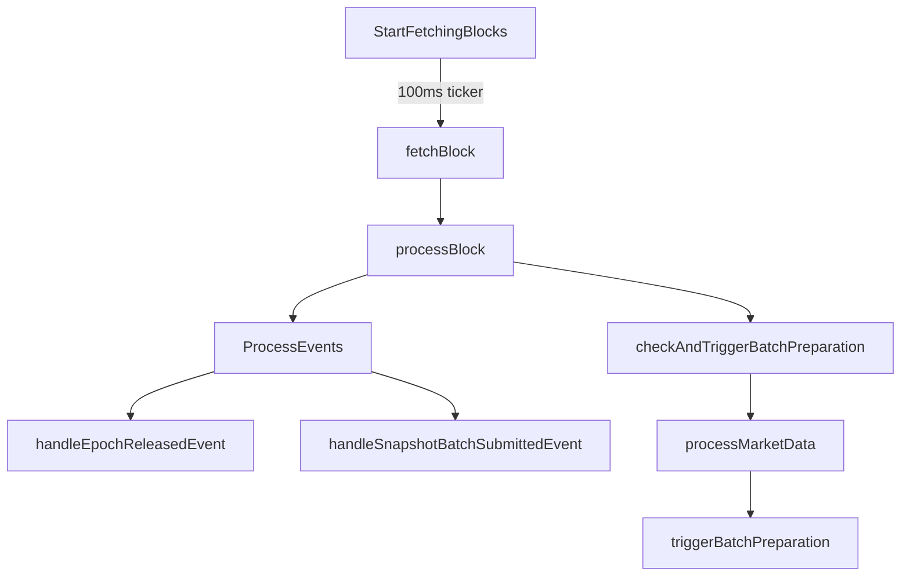

# Submission Sequencer Event Collector: Comprehensive Analysis & Improvement Plan

## 1. System Architecture Overview

### 1.1 Core Components
- **Event Collector Service**
  - Block fetching and processing
  - Event detection and handling
  - Batch preparation and submission
- **Data Market Management**
  - Multiple data market support
  - Market-specific configuration
  - Epoch and day transition handling
- **Resource Management**
  - Memory pools
  - Worker pools
  - Context management
- **Storage Layer**
  - Redis for caching and queues
  - Blockchain state management

### 1.2 Processing Flow


## 2. Current Issues & Improvements

### 2.1 Memory Management
#### Issues:
1. **Memory Leaks**
   - Unbounded slice growth in block processing
   - Inefficient memory reuse in batch processing
   - Large object allocations in event processing

#### Improvements:
```go
// 1. Bounded Buffer Implementation
const maxBlocksPerBatch = 100
if blocksToProcess > maxBlocksPerBatch {
    lastProcessedBlock = latestBlockNumber - maxBlocksPerBatch
}

// 2. Memory Pool Optimization
var (
    headerPool = sync.Pool{
        New: func() any {
            return &[]string{} // Zero initial capacity
        },
    }
    batchPool = sync.Pool{
        New: func() any {
            return make(map[string][]string)
        },
    }
)

// 3. Resource Cleanup
defer func() {
    headerPool.Put(headers)
    batchPool.Put(batch)
}()
```

### 2.2 Goroutine Management
#### Issues:
1. **Goroutine Leaks**
   - Unbounded goroutine creation
   - Missing timeout handling
   - Improper cleanup on context cancellation

#### Improvements:
```go
// 1. Worker Pool Implementation
var (
    workerPool = make(chan struct{}, runtime.GOMAXPROCS(0)*2)
    activeWorkers sync.WaitGroup
)

// 2. Controlled Concurrency
func processWithWorkerPool(ctx context.Context, task func() error) error {
    select {
    case workerPool <- struct{}{}:
        activeWorkers.Add(1)
        defer func() {
            <-workerPool
            activeWorkers.Done()
        }()
        return task()
    case <-ctx.Done():
        return ctx.Err()
    }
}

// 3. Graceful Shutdown
func cleanup() {
    shutdownCtx, cancel := context.WithTimeout(context.Background(), 30*time.Second)
    defer cancel()
    
    done := make(chan struct{})
    go func() {
        activeWorkers.Wait()
        close(done)
    }()

    select {
    case <-done:
        log.Info("All workers completed")
    case <-shutdownCtx.Done():
        log.Warn("Shutdown timeout reached")
    }
}
```

### 2.3 Context Management
#### Issues:
1. **Context Hierarchy**
   - Incorrect parent-child relationships
   - Inconsistent timeout values
   - Missing cancellation propagation

#### Improvements:
```go
// 1. Proper Context Hierarchy
const (
    rootTimeout           = 5 * time.Minute
    blockTimeout         = 1 * time.Minute
    eventTimeout         = 30 * time.Second
    batchTimeout        = 2 * time.Minute
)

// 2. Context Chain
func processBlock(parentCtx context.Context, block *types.Block) error {
    ctx, cancel := context.WithTimeout(parentCtx, blockTimeout)
    defer cancel()

    g, ctx := errgroup.WithContext(ctx)
    
    g.Go(func() error {
        return processEvents(ctx, block)
    })
    
    g.Go(func() error {
        return prepareBatch(ctx, block)
    })

    return g.Wait()
}

// 3. Resource Cleanup
func processWithTimeout(ctx context.Context, timeout time.Duration, 
    operation func(context.Context) error) error {
    opCtx, cancel := context.WithTimeout(ctx, timeout)
    defer cancel()

    done := make(chan error, 1)
    go func() {
        done <- operation(opCtx)
    }()

    select {
    case err := <-done:
        return err
    case <-ctx.Done():
        return ctx.Err()
    }
}
```

### 2.4 Resource Leak Prevention
#### Issues:
1. **File Descriptors**
   - Unclosed network connections
   - Leaked Redis connections
   - Unclosed response bodies

#### Improvements:
```go
// 1. Connection Pool Management
type ConnectionPool struct {
    pool    *sync.Pool
    active  int32
    maxSize int32
}

// 2. Resource Cleanup
func withResource[T any](res T, cleanup func(T), 
    operation func(T) error) error {
    defer cleanup(res)
    return operation(res)
}

// 3. Error Path Handling
func processWithCleanup(ctx context.Context, 
    setup func() (cleanup func() error, err error),
    operation func() error) (err error) {
    cleanup, err := setup()
    if err != nil {
        return fmt.Errorf("setup failed: %w", err)
    }
    defer func() {
        if cleanupErr := cleanup(); cleanupErr != nil {
            err = errors.Join(err, cleanupErr)
        }
    }()
    return operation()
}
```

## 3. Performance Optimizations

### 3.1 Batch Processing
```go
// 1. Batch Size Optimization
const (
    minBatchSize = 50
    maxBatchSize = 1000
    targetLatency = 100 * time.Millisecond
)

// 2. Dynamic Batch Sizing
func calculateOptimalBatchSize(currentSize int, latency time.Duration) int {
    ratio := float64(targetLatency) / float64(latency)
    newSize := int(float64(currentSize) * ratio)
    
    if newSize < minBatchSize {
        return minBatchSize
    }
    if newSize > maxBatchSize {
        return maxBatchSize
    }
    return newSize
}

// 3. Parallel Processing
func processBatchParallel(items []Item) error {
    const maxGoroutines = 4
    sem := make(chan struct{}, maxGoroutines)
    
    return parallel.ForEach(items, func(item Item) error {
        sem <- struct{}{}
        defer func() { <-sem }()
        return processItem(item)
    })
}
```

### 3.2 Caching Strategy
```go
// 1. Multi-Level Cache
type Cache struct {
    l1 *ristretto.Cache // In-memory
    l2 *redis.Client    // Redis
}

// 2. Cache Warming
func (c *Cache) warmCache(keys []string) error {
    missing := c.l1.Missing(keys)
    if len(missing) == 0 {
        return nil
    }
    
    values, err := c.l2.MGet(missing...)
    if err != nil {
        return err
    }
    
    for i, key := range missing {
        c.l1.Set(key, values[i], 1)
    }
    return nil
}

// 3. Predictive Loading
func (c *Cache) preloadNext(currentBlock int64) {
    nextBlock := currentBlock + 1
    go c.warmCache([]string{
        fmt.Sprintf("block:%d", nextBlock),
        fmt.Sprintf("events:%d", nextBlock),
    })
}
```

## 4. Monitoring & Observability

### 4.1 Metrics
```go
// 1. Performance Metrics
var metrics = struct {
    blockProcessingTime   prometheus.Histogram
    eventProcessingTime   prometheus.Histogram
    batchPreparationTime prometheus.Histogram
    activeGoroutines     prometheus.Gauge
    memoryUsage         prometheus.Gauge
    errorCount          prometheus.Counter
}{
    blockProcessingTime: prometheus.NewHistogram(prometheus.HistogramOpts{
        Name: "block_processing_duration_seconds",
        Help: "Time spent processing blocks",
        Buckets: prometheus.ExponentialBuckets(0.1, 2, 10),
    }),
    // ... other metric definitions
}

// 2. Resource Metrics
func recordResourceMetrics() {
    var m runtime.MemStats
    runtime.ReadMemStats(&m)
    
    metrics.memoryUsage.Set(float64(m.Alloc))
    metrics.activeGoroutines.Set(float64(runtime.NumGoroutine()))
}

// 3. Error Tracking
func recordError(err error, operation string) {
    metrics.errorCount.Inc()
    log.WithFields(log.Fields{
        "operation": operation,
        "error": err.Error(),
    }).Error("Operation failed")
}
```

### 4.2 Logging
```go
// 1. Structured Logging
func logWithContext(ctx context.Context, msg string, fields log.Fields) {
    fields["trace_id"] = trace.FromContext(ctx)
    fields["timestamp"] = time.Now().UTC()
    
    log.WithFields(fields).Info(msg)
}

// 2. Error Logging
func logError(ctx context.Context, err error, operation string) {
    log.WithFields(log.Fields{
        "error": err.Error(),
        "operation": operation,
        "trace_id": trace.FromContext(ctx),
        "stack": debug.Stack(),
    }).Error("Operation failed")
}

// 3. Performance Logging
func logPerformance(ctx context.Context, operation string, duration time.Duration) {
    log.WithFields(log.Fields{
        "operation": operation,
        "duration_ms": duration.Milliseconds(),
        "trace_id": trace.FromContext(ctx),
    }).Debug("Performance measurement")
}
```

## 5. Implementation Plan

### 5.1 Priority Order
1. **Critical Fixes**
   - Memory leak prevention
   - Goroutine management
   - Context hierarchy fixes
   - Resource cleanup

2. **Performance Improvements**
   - Batch processing optimization
   - Caching strategy implementation
   - Connection pooling

3. **Monitoring & Observability**
   - Metrics implementation
   - Logging enhancement
   - Error tracking

### 5.2 Testing Strategy
1. **Unit Tests**
   - Resource management
   - Context handling
   - Error scenarios

2. **Integration Tests**
   - End-to-end flows
   - Performance benchmarks
   - Resource usage patterns

3. **Load Tests**
   - Concurrent processing
   - Memory usage patterns
   - Error handling under load

### 5.3 Rollout Plan
1. **Phase 1: Critical Fixes**
   - Deploy memory management improvements
   - Implement proper context hierarchy
   - Add resource cleanup

2. **Phase 2: Performance**
   - Roll out batch processing optimizations
   - Implement caching improvements
   - Add connection pooling

3. **Phase 3: Monitoring**
   - Deploy metrics collection
   - Enhance logging
   - Add error tracking

## 6. Future Considerations

### 6.1 Scalability
- Horizontal scaling capabilities
- Load balancing strategies
- Distributed processing options

### 6.2 Resilience
- Circuit breaker patterns
- Retry strategies
- Fallback mechanisms

### 6.3 Maintenance
- Configuration management
- Deployment automation
- Monitoring dashboards
