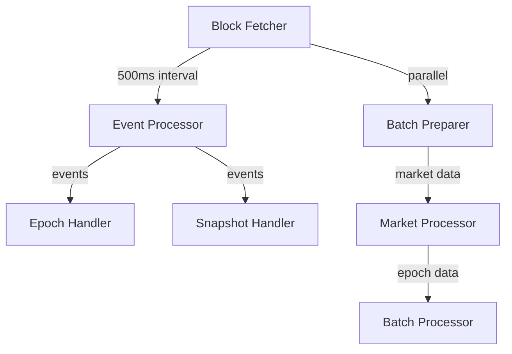

# Submission Sequencer Event Collector

## 1. System Overview

The Submission Sequencer Event Collector is responsible for monitoring blockchain events, processing submissions, and preparing batches for the attestation process. It operates continuously, processing blocks and managing data across multiple markets.

### 1.1 Core Responsibilities

- Block monitoring and event detection
- Epoch management and batch preparation
- Submission counting and validation
- Reward updates and distribution tracking
- Redis-based state management

## 2. Architecture

### 2.1 Component Hierarchy



### 2.2 Timeout Hierarchy

```go
const (
    // Base operation timeout
    redisOperationTimeout = 5 * time.Second
    
    // Processing timeouts
    eventProcessingTimeout = 30 * time.Second
    batchProcessingTimeout = 30 * time.Second
    
    // Market-level timeouts
    marketProcessingTimeout = 120 * time.Second
    batchPreparationTimeout = 90 * time.Second
)
```

## 3. Core Processing Flows

```
StartFetchingBlocks(ctx)
├── cleanup() [deferred]
├── → Client.HeaderByNumber(initFetchCtx) [initial block]
└── For each tick:
    ├── → Client.HeaderByNumber(fetchCtx) [latest block]
    └── For each block:
        ├── → fetchBlock(blockCtx)
        │   └── → Client.BlockByNumber with retry
        │
        ├── errChan := make(chan error, 3)
        ├── var wg sync.WaitGroup
        │
        ├── ⟿ ProcessEvents(eventProcessCtx)
        │   ├── → Client.FilterLogs with retry
        │   ├── errChan := make(chan error, len(logs))
        │   ├── var wg sync.WaitGroup
        │   └── For each log:
        │       ⟿ (event handler goroutine)
        │          ├── → handleEpochReleasedEvent
        │          │   ├── → Instance.ParseEpochReleased
        │          │   ├── → calculateSubmissionLimitBlock
        │          │   ├── → sendRewardUpdates (if interval)
        │          │   │   └── → SendUpdateRewardsToRelayer
        │          │   └── → redis.StoreEpochDetails
        │          │
        │          └── → handleSnapshotBatchSubmittedEvent
        │              ├── → Instance.ParseSnapshotBatchSubmitted
        │              └── → redis.LPush (if enabled)
        │   └── collect errors from errChan
        │
        ├── ⟿ processEpochDeadlinesForDataMarkets(marketEpochDeadlineProcessCtx)
        │   ├── errChan := make(chan error, len(dataMarketAddresses))
        │   ├── var wg sync.WaitGroup
        │   └── For each market:
        │       ⟿ checkAndTriggerBatchPreparation(marketCtx)
        │          ├── → redis.SMembers (epoch markers)
        │          ├── errChan := make(chan error, len(epochMarkerKeys))
        │          ├── var wg sync.WaitGroup
        │          └── For each marker:
        │              ├── → redis.Get (marker details)
        │              └── → triggerBatchPreparation
        │                  ├── → redis.Get (block hashes) for each block
        │                  ├── → getValidSubmissionKeys
        │                  ├── → UpdateSlotSubmissionCount
        │                  │   ├── → FetchCurrentDay
        │                  │   ├── ⟿ sendFinalRewards
        │                  │   │   └── errChan := make(chan error, 1)
        │                  │   ├── → handleDayTransition
        │                  │   └── → redis operations
        │                  ├── → constructProjectMap
        │                  ├── → arrangeSubmissionKeysInBatches
        │                  ├── → redis.SetWithExpiration (batch count)
        │                  ├── → SendBatchSizeToRelayer
        │                  ├── var wg sync.WaitGroup
        │                  └── For each batch:
        │                      ⟿ Process Batch
        │                         ├── → json.Marshal
        │                         ├── → redis.LPush
        │                         └── → redis.StoreBatchDetails
        │                  └── collect errors from errChan
        │          └── collect errors from errChan
        │   └── collect errors from errChan
        │
        ├── ⟿ redis.SetWithExpiration(redisCtx)
        │
        └── collect errors from errChan
```

### 3.1. Timeout hierarchies

```
StartFetchingBlocks(unlimited ctx)
├── cleanup() [deferred]
├── → Client.HeaderByNumber(initFetchCtx - 5s) [initial block]
└── For each tick:
    ├── → Client.HeaderByNumber(fetchCtx - 5s) [latest block]
    └── For each block:
        ├── → fetchBlock(blockCtx - 30s)
        │   └── → Client.BlockByNumber with retry
        │
        ├── errChan := make(chan error, 3)
        ├── var wg sync.WaitGroup
        │
        ├── ⟿ ProcessEvents(eventProcessCtx - 30s)
        │   ├── → Client.FilterLogs with retry
        │   ├── errChan := make(chan error, len(logs))
        │   ├── var wg sync.WaitGroup
        │   └── For each log:
        │       ⟿ (event handler goroutine)
        │          ├── eventCtx - 30s
        │          │   ├── handleEpochReleasedEvent
        │          │   │   ├── redis operations (redisCtx - 5s)
        │          │   │   └── SendUpdateRewardsToRelayer
        │          │   │
        │          │   └── handleSnapshotBatchSubmittedEvent
        │          │       └── redis operations (redisCtx - 5s)
        │
        ├── ⟿ processEpochDeadlinesForDataMarkets(marketEpochDeadlineProcessCtx - 120s)
        │   ├── errChan := make(chan error, len(dataMarketAddresses))
        │   └── For each market:
        │       ⟿ checkAndTriggerBatchPreparation(marketCtx - 90s)
        │          ├── redis operations (redisCtx - 5s)
        │          └── For each marker:
        │              ├── redis operations (redisCtx - 5s)
        │              └── triggerBatchPreparation
        │                  ├── redis operations (redisCtx - 5s)
        │                  ├── getValidSubmissionKeys (submissionCtx - 30s)
        │                  ├── UpdateSlotSubmissionCount
        │                  │   └── redis operations (redisCtx - 5s)
        │                  └── For each batch:
        │                      ⟿ Process Batch
        │                         └── redis operations (redisCtx - 5s)
        │
        └── ⟿ redis.SetWithExpiration(redisCtx - 5s)
```

## 4. Resource Management

### 4.1 Context Management

- Hierarchical context flow with defined timeouts
- Proper cancellation propagation
- Resource cleanup on context termination
- Structured error handling with error groups

### 4.2 Redis Operations

- Connection pooling for optimal resource usage
- 5-second timeout for all operations
- Exponential backoff for retries
- Automatic connection cleanup

### 4.3 Error Handling

```go
func processMarketData(ctx context.Context, dataMarketAddress string) (err error) {
    defer func() {
        if r := recover(); r != nil {
            buf := make([]byte, 64<<10)
            n := runtime.Stack(buf, false)
            err = fmt.Errorf("panic in market processing: %v\n%s", r, buf[:n])
            log.WithError(err).Error("Recovered from panic in market processing")
            metrics.IncPanics("market_processing")
        }
    }()
    // Processing logic
}
```

## 5. Monitoring and Observability

### 5.1 Metrics

- Operation latencies
- Error counts by category
- Panic occurrences
- Processing throughput
- Redis operation latencies

### 5.2 Logging

- Structured logging with context
- Error details with stack traces
- Processing milestone markers
- Timeout and cancellation events

## 6. Configuration

### 6.1 Environment Variables

- Redis connection details
- Blockchain node URL
- Processing intervals
- Timeout durations
- Market addresses

### 6.2 Runtime Parameters

- Batch sizes
- Retry policies
- Connection pool sizes
- Logging levels

## 7. Recovery and Resilience

### 7.1 Panic Recovery
- Stack trace capture
- Error categorization
- Metric incrementation
- Logging with context

### 7.2 Error Categories
1. Context cancellation (expected)
2. Timeouts (expected but monitored)
3. Redis operations (retried)
4. Processing errors (logged)
5. Panics (recovered and logged)

### 7.3 Retry Strategies
- Redis operations: Exponential backoff
- Block fetching: Immediate retry with backoff
- Batch processing: Configurable retries

