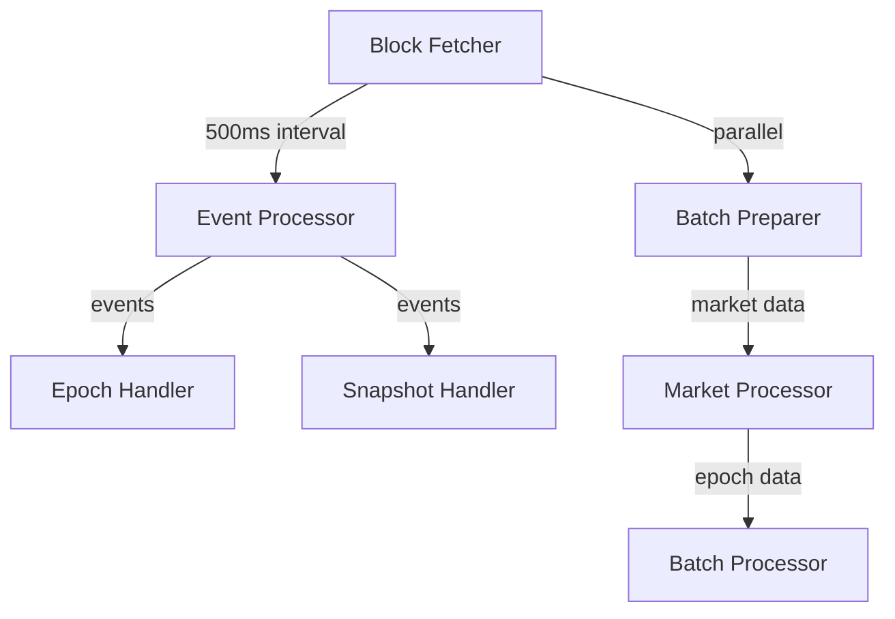

# Submission Sequencer Event Collector

## 1. System Overview

The Submission Sequencer Event Collector is responsible for monitoring blockchain events, processing submissions, and preparing batches for the attestation process. It operates continuously, processing blocks and managing data across multiple markets.

### 1.1 Core Responsibilities

- Block monitoring and event detection
- Epoch management and batch preparation
- Submission counting and validation
- Reward updates and distribution tracking
- Redis-based state management

## 2. Architecture

### 2.1 Component Hierarchy



### 2.2 Timeout Hierarchy

```go
const (
    // Base operation timeout
    redisOperationTimeout = 5 * time.Second
    
    // Processing timeouts
    eventProcessingTimeout = 30 * time.Second
    batchProcessingTimeout = 30 * time.Second
    
    // Market-level timeouts
    marketProcessingTimeout = 120 * time.Second
    batchPreparationTimeout = 90 * time.Second
)
```

## 3. Core Processing Flows

### 3.1 Block Processing and Event Detection


```
StartFetchingBlocks (continuous)
├── Fetch latest block every 500ms
├── Process new blocks concurrently
│ ├── Event Processing Path (parallel)
│ └── Batch Preparation Path (parallel)
└── Update last processed block
```

### 3.2 Event Processing Path

```
ProcessEvents (30s timeout)
├── For each event log:
│ ├── EpochReleased Event
│ │ ├── Calculate submission limit block
│ │ ├── Update rewards (on interval)
│ │ └── Store epoch details (Redis, 5s)
│ └── SnapshotBatchSubmitted Event
│ └── Queue for attestation (Redis, 5s)
└── Log completion/errors
```

### 3.3 Batch Preparation Path

```
processMarketData (120s timeout)
├── For each market:
│ └── processSingleEpoch (90s timeout)
│ └── triggerBatchPreparation
│ ├── Collect block headers
│ ├── Get valid submission keys
│ ├── Update submission counts
│ ├── Create project batches
│ └── Process batches (30s each)
└── Update state in Redis (5s)
```

## 4. Resource Management

### 4.1 Context Management

- Hierarchical context flow with defined timeouts
- Proper cancellation propagation
- Resource cleanup on context termination
- Structured error handling with error groups

### 4.2 Redis Operations

- Connection pooling for optimal resource usage
- 5-second timeout for all operations
- Exponential backoff for retries
- Automatic connection cleanup

### 4.3 Error Handling

```go
func processMarketData(ctx context.Context, dataMarketAddress string) (err error) {
    defer func() {
        if r := recover(); r != nil {
            buf := make([]byte, 64<<10)
            n := runtime.Stack(buf, false)
            err = fmt.Errorf("panic in market processing: %v\n%s", r, buf[:n])
            log.WithError(err).Error("Recovered from panic in market processing")
            metrics.IncPanics("market_processing")
        }
    }()
    // Processing logic
}
```

## 5. Monitoring and Observability

### 5.1 Metrics

- Operation latencies
- Error counts by category
- Panic occurrences
- Processing throughput
- Redis operation latencies

### 5.2 Logging

- Structured logging with context
- Error details with stack traces
- Processing milestone markers
- Timeout and cancellation events

## 6. Configuration

### 6.1 Environment Variables

- Redis connection details
- Blockchain node URL
- Processing intervals
- Timeout durations
- Market addresses

### 6.2 Runtime Parameters

- Batch sizes
- Retry policies
- Connection pool sizes
- Logging levels

## 7. Recovery and Resilience

### 7.1 Panic Recovery
- Stack trace capture
- Error categorization
- Metric incrementation
- Logging with context

### 7.2 Error Categories
1. Context cancellation (expected)
2. Timeouts (expected but monitored)
3. Redis operations (retried)
4. Processing errors (logged)
5. Panics (recovered and logged)

### 7.3 Retry Strategies
- Redis operations: Exponential backoff
- Block fetching: Immediate retry with backoff
- Batch processing: Configurable retries

