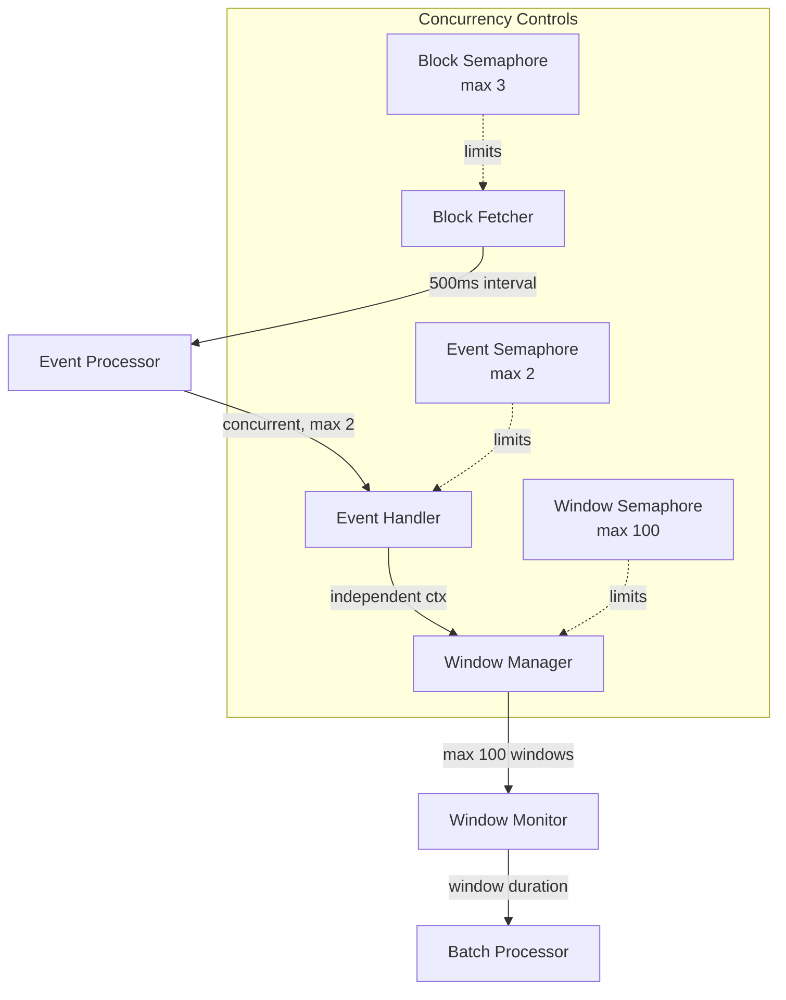

# Submission Sequencer Event Collector

## 1. System Overview

The Submission Sequencer Event Collector is responsible for monitoring blockchain events, processing submissions, and preparing batches for the attestation process. It operates continuously, processing blocks and managing data across multiple markets.

### 1.1 Core Responsibilities

- Block monitoring and event detection
- Epoch management and batch preparation
- Submission counting and validation
- Reward updates and distribution tracking
- Redis-based state management

## 2. Architecture

### 2.1 Component Hierarchy



### 2.2 Resource Management

```go
// Concurrency limits
const (
    maxConcurrentBlocks = 3
    maxConcurrentEvents = 2
    maxActiveWindows = 100
)

// Context hierarchy
type ContextLevel struct {
    BlockProcessing    context.Context  // Parent context from main
    EventProcessing    context.Context  // Independent from Background()
    WindowManagement   context.Context  // Independent per window
    BatchProcessing    context.Context  // Child of window context
}

// Semaphore controls
type ConcurrencyControl struct {
    blockSemaphore    chan struct{}  // Limits concurrent block processing
    eventSemaphore    chan struct{}  // Limits concurrent event handling
    windowSemaphore   chan struct{}  // Limits active submission windows
}
```

### 2.3 Timeout Hierarchy

```go
const (
    // Base operation timeout
    redisOperationTimeout = 5 * time.Second
    
    // Processing timeouts
    eventProcessingTimeout = 30 * time.Second
    batchProcessingTimeout = 30 * time.Second
    blockFetchTimeout = 5 * time.Second
    
    // Market-level timeouts
    marketProcessingTimeout = 120 * time.Second
    batchPreparationTimeout = 90 * time.Second
)
```

### 2.4 Component Responsibilities

#### Block Fetcher
- Monitors blockchain for new blocks
- Manages concurrent block processing (max 3)
- Coordinates event processing initiation

#### Event Processor
- Processes blockchain events concurrently (max 2)
- Manages independent event processing contexts
- Handles event filtering and distribution

#### Window Manager
- Controls submission window lifecycle
- Manages window concurrency (max 100)
- Handles window cleanup and monitoring

#### Batch Processor
- Processes batches within window context
- Manages batch preparation and submission
- Handles batch-related error propagation

## 3. Core Processing Flows

```
StartFetchingBlocks(ctx)
├── cleanup() [deferred]
├── → Client.HeaderByNumber(initFetchCtx) [initial block]
└── For each tick:
    ├── → Client.HeaderByNumber(fetchCtx) [latest block]
    └── For each block:
        ├── blockSemaphore := make(chan struct{}, 3)
        ├── → fetchBlock(blockCtx)
        │   └── → Client.BlockByNumber with retry
        │
        ├── errChan := make(chan error, 3)
        ├── var wg sync.WaitGroup
        │
        ├── ⟿ ProcessEvents(independent eventCtx)
        │   ├── → Client.FilterLogs with retry
        │   ├── eventSemaphore := make(chan struct{}, 2)
        │   ├── errChan := make(chan error, len(logs))
        │   ├── var wg sync.WaitGroup
        │   └── For each log:
        │       ⟿ (event handler goroutine)
        │          ├── → handleEpochReleasedEvent
        │          │   ├── → Instance.ParseEpochReleased
        │          │   ├── → calculateSubmissionLimitBlock
        │          │   ├── → StartSubmissionWindow(independent context)
        │          │   │   └── ⟿ Window Management
        │          │   │       ├── windowSemaphore := make(chan struct{}, maxWindows)
        │          │   │       └── Monitor Goroutine
        │          │   │           ├── Timer Management
        │          │   │           └── Batch Processing
        │          │   │
        │          │   ├── → sendRewardUpdates (if interval, 1min timeout)
        │          │   │   └── → SendUpdateRewardsToRelayer
        │          │   └── → redis.StoreEpochDetails
        │          │
        │          └── → handleSnapshotBatchSubmittedEvent
        │              ├── → Instance.ParseSnapshotBatchSubmitted
        │              └── → redis.LPush (if enabled)
        │   └── collect errors from errChan
        │
        ├── ⟿ processEpochDeadlinesForDataMarkets(marketEpochDeadlineProcessCtx)
        │   ├── errChan := make(chan error, len(dataMarketAddresses))
        │   ├── var wg sync.WaitGroup
        │   └── For each market:
        │       ⟿ checkAndTriggerBatchPreparation(marketCtx)
        │          ├── → redis.SMembers (epoch markers)
        │          ├── errChan := make(chan error, len(epochMarkerKeys))
        │          ├── var wg sync.WaitGroup
        │          └── For each marker:
        │              ├── → redis.Get (marker details)
        │              └── → triggerBatchPreparation
        │                  ├── → redis.Get (block hashes) for each block
        │                  ├── → getValidSubmissionKeys
        │                  ├── → UpdateSlotSubmissionCount
        │                  │   ├── → FetchCurrentDay
        │                  │   ├── ⟿ sendFinalRewards
        │                  │   │   └── errChan := make(chan error, 1)
        │                  │   ├── → handleDayTransition
        │                  │   └── → redis operations
        │                  ├── → constructProjectMap
        │                  ├── → arrangeSubmissionKeysInBatches
        │                  ├── → redis.SetWithExpiration (batch count)
        │                  ├── → SendBatchSizeToRelayer
        │                  ├── var wg sync.WaitGroup
        │                  └── For each batch:
        │                      ⟿ Process Batch
        │                         ├── → json.Marshal
        │                         ├── → redis.LPush
        │                         └── → redis.StoreBatchDetails
        │                  └── collect errors from errChan
        │          └── collect errors from errChan
        │   └── collect errors from errChan
        │
        ├── ⟿ redis.SetWithExpiration(redisCtx)
        │
        └── collect errors from errChan
```

### 3.1. Timeout hierarchies

```
StartFetchingBlocks(unlimited ctx)
├── cleanup() [deferred]
├── → Client.HeaderByNumber(initFetchCtx - 5s) [initial block]
└── For each tick:
    ├── → Client.HeaderByNumber(fetchCtx - 5s) [latest block]
    └── For each block:
        ├── → fetchBlock(blockCtx - 30s)
        │   └── → Client.BlockByNumber with retry
        │
        ├── errChan := make(chan error, 3)
        ├── var wg sync.WaitGroup
        │
        ├── ⟿ ProcessEvents(eventProcessCtx - 30s)
        │   ├── → Client.FilterLogs with retry
        │   ├── errChan := make(chan error, len(logs))
        │   ├── var wg sync.WaitGroup
        │   └── For each log:
        │       ⟿ (event handler goroutine)
        │          ├── eventCtx - 30s
        │          │   ├── handleEpochReleasedEvent
        │          │   │   ├── redis operations (redisCtx - 5s)
        │          │   │   └── SendUpdateRewardsToRelayer
        │          │   │
        │          │   └── handleSnapshotBatchSubmittedEvent
        │          │       └── redis operations (redisCtx - 5s)
        │
        ├── ⟿ processEpochDeadlinesForDataMarkets(marketEpochDeadlineProcessCtx - 120s)
        │   ├── errChan := make(chan error, len(dataMarketAddresses))
        │   └── For each market:
        │       ⟿ checkAndTriggerBatchPreparation(marketCtx - 90s)
        │          ├── redis operations (redisCtx - 5s)
        │          └── For each marker:
        │              ├── redis operations (redisCtx - 5s)
        │              └── triggerBatchPreparation
        │                  ├── redis operations (redisCtx - 5s)
        │                  ├── getValidSubmissionKeys (submissionCtx - 30s)
        │                  ├── UpdateSlotSubmissionCount
        │                  │   └── redis operations (redisCtx - 5s)
        │                  └── For each batch:
        │                      ⟿ Process Batch
        │                         └── redis operations (redisCtx - 5s)
        │
        └── ⟿ redis.SetWithExpiration(redisCtx - 5s)
```

## 4. Resource Management

### 4.1 Context Management

- Independent context hierarchies for major components
  - Block processing: Parent context from main application
  - Event processing: Independent context from Background()
  - Window management: Independent context per window
  - Batch processing: Child context of window context

- Context cancellation patterns
  - Proper cleanup on context cancellation
  - Timeout management with defer patterns
  - Resource release guarantees
  - Error propagation through channels

### 4.2 Concurrency Control

- Semaphore-based limits
  ```go
  // Block processing
  blockSemaphore := make(chan struct{}, 3)
  
  // Event processing
  eventSemaphore := make(chan struct{}, 2)
  
  // Window management
  windowSemaphore := make(chan struct{}, maxWindows)
  ```

- Acquisition patterns
  ```go
  // With timeout
  select {
  case sem <- struct{}{}:
      // Got permission
  case <-time.After(timeout):
      // Handle timeout
  case <-ctx.Done():
      // Handle cancellation
  }
  
  // Guaranteed release
  defer func() { <-sem }()
  ```

### 4.3 Error Handling

- Context-aware error channels
  ```go
  select {
  case errChan <- err:
      // Error sent
  case <-ctx.Done():
      // Context cancelled
  }
  ```

- Error collection patterns
  ```go
  // Wait with timeout
  select {
  case <-done:
      for err := range errChan {
          errs = append(errs, err)
      }
  case <-ctx.Done():
      return ctx.Err()
  }
  ```

### 4.4 Resource Cleanup

- Deferred cleanup
  ```go
  defer func() {
      window.Timer.Stop()
      close(window.Done)
      wm.removeWindow(dataMarketAddress, epochID)
  }()
  ```

- Safety timeouts
  ```go
  safetyTimeout := windowDuration + 5*time.Minute
  select {
  case <-monitorDone:
      // Normal completion
  case <-time.After(safetyTimeout):
      // Force cleanup
  }
  ```

## 5. Monitoring and Observability

### 5.1 Memory Profiling

- Periodic memory stats (every 2 minutes)
  - Alloc: Current heap allocation
  - TotalAlloc: Cumulative allocation
  - Sys: Total memory obtained from OS
  - NumGC: Number of completed GC cycles

- Goroutine monitoring
  - Current count tracking
  - Pattern analysis (oscillation between 9-21)
  - Correlation with system events

### 5.2 Logging

- Structured logging with context
  ```go
  log.WithFields(log.Fields{
      "component": "window_manager",
      "epoch_id": epochID,
      "market": dataMarketAddress,
  }).Info("message")
  ```

- Event tracking
  - Window lifecycle events
  - Resource acquisition/release
  - Error conditions
  - Cleanup operations

### 5.3 Metrics

- System health
  - Goroutine count
  - Memory usage
  - GC frequency

- Business metrics
  - Active windows
  - Processing throughput
  - Error rates

## 6. Configuration

### 6.1 Concurrency Settings

```go
type Config struct {
    MaxConcurrentBlocks    int           `env:"MAX_CONCURRENT_BLOCKS" default:"3"`
    MaxConcurrentEvents    int           `env:"MAX_CONCURRENT_EVENTS" default:"2"`
    MaxActiveWindows       int           `env:"MAX_ACTIVE_WINDOWS" default:"100"`
    BlockFetchInterval     time.Duration `env:"BLOCK_FETCH_INTERVAL" default:"500ms"`
}
```

### 6.2 Timeouts

```go
type TimeoutConfig struct {
    BlockFetch       time.Duration `env:"BLOCK_FETCH_TIMEOUT" default:"5s"`
    EventProcessing  time.Duration `env:"EVENT_PROCESSING_TIMEOUT" default:"30s"`
    BatchProcessing  time.Duration `env:"BATCH_PROCESSING_TIMEOUT" default:"30s"`
    RedisOperation   time.Duration `env:"REDIS_OPERATION_TIMEOUT" default:"5s"`
}
```

## 7. Recovery and Resilience

### 7.1 Panic Recovery

- Component-level recovery
  ```go
  defer func() {
      if r := recover(); r != nil {
          log.Errorf("💥 Panic in component: %v", r)
      }
  }()
  ```

### 7.2 Resource Protection

- Semaphore guarantees
- Context cancellation
- Cleanup operations

### 7.3 Monitoring Thresholds

- Memory usage alerts
- Goroutine count warnings
- Error rate monitoring

