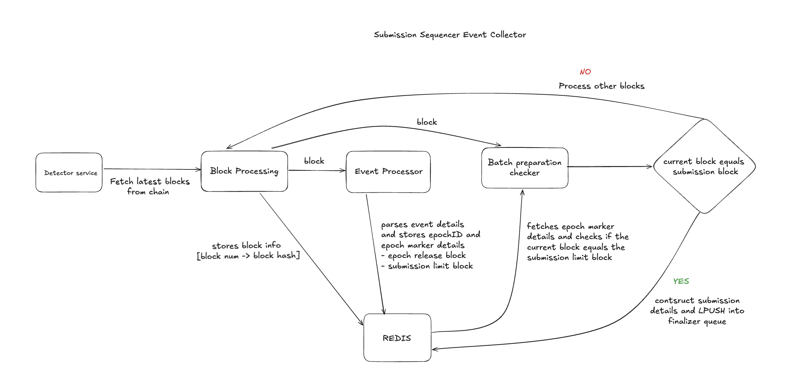
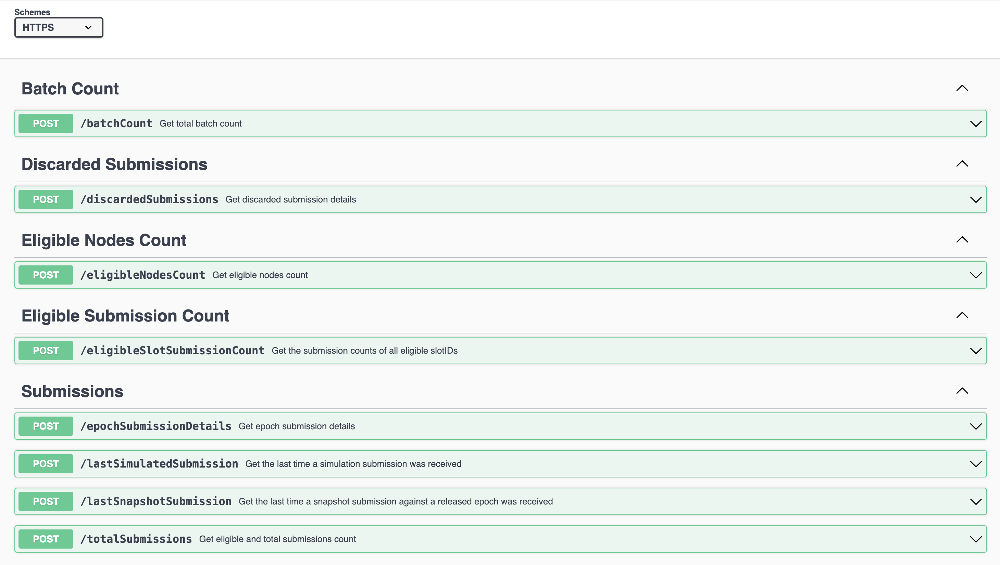

## Table of Contents
- [Table of Contents](#table-of-contents)
- [Overview](#overview)
  - [Block Detection](#block-detection)
  - [Event Processing](#event-processing)
  - [Batch Preparation](#batch-preparation)
  - [Batch Submission](#batch-submission)
- [Architecture](#architecture)
- [On-Chain Updates](#on-chain-updates-via-relayer)
- [APIs](#apis)
    - [`/totalSubmissions`](#totalsubmissions)
    - [`/eligibleNodesCount`](#eligiblenodescount)
    - [`/batchCount`](#batchcount)
    - [`/epochSubmissionDetails`](#epochsubmissiondetails)
    - [`/eligibleSlotSubmissionCount`](#eligibleslotsubmissioncount)
    - [`/discardedSubmissions`](#discardedsubmissions)
    - [`/lastSimulatedSubmission`](#lastsimulatedsubmission)
    - [`/lastSnapshotSubmission`](#lastsnapshotsubmission)
- [Find us](#find-us)

## Overview



The Event Collector is a key component of the **Submission Sequencer** system, responsible for interacting with the blockchain, processing events from detected blocks, and preparing data for downstream processing. Its primary role is to detect and parse critical events, aggregate event data into batches, and send these batches to the **Finalizer** component for further actions.

By operating seamlessly within the broader system, the Event Collector ensures timely and reliable processing of blockchain data, which is critical for maintaining the integrity and accuracy of the Submission Sequencer.

Key functionalities:

- **Block Detection:** Continuously monitors the blockchain to fetch the latest blocks and process them sequentially.
- **Event Processing:** Extracts and processes logs from the detected blocks, focusing on parsing and storing specific event details such as details from the `EpochReleased` event.
- **Batch Preparation:** Aggregates the event data collected during event processing and organises it into structured batches for submission.
- **Batch Submission:** After batch preparation, the system constructs submission details and pushes these batches into the finalizer queue for further processing.

### Block Detection
The Event Collector actively monitors the blockchain to detect new blocks, maintaining real-time synchronization with the network. It begins by identifying the latest block and processes subsequent blocks in sequential order. Key details, such as block numbers and block hashes, are captured and stored in Redis, enabling efficient event processing and reliable data validation.

### Event Processing
Once a block is detected, the Event Collector extracts and processes the events emitted from the block, focusing on those critical to the Submission Sequencer system. These events include: 
- `EpochReleased`: Signals the release of a new epoch, triggering the start of batch submission for that epoch
- `SnapshotBatchSubmitted`: Signals that the sequencer has submitted a batch of snapshot submissions, including their claimed finalizations, for a specific epochID and data market
- `EndBatchSubmissions`: This event is emitted when the sequencer has completed submitting all snapshot batches for a specific epochID and data market

Using a filter query applied during block detection, the system retrieves logs associated with specific smart contract events. 

These logs are then parsed to extract event parameters, such as the epoch release block number, which is then used to calculate the submission limit block number by adding the submission window. 

```
submissionLimitBlockNumber := epochReleaseBlockNumber + submissionWindow
```

These epoch marker details are then stored in Redis for quick and efficient retrieval.

### Batch Preparation
This process involves monitoring stored epoch marker details to track progress toward submission limits. The Event Collector periodically checks these markers to identify when the current block number aligns with the calculated submission limit block number for a given epoch.

When a match is identified, it indicates the end of the submission window, prompting the system to initiate the batch preparation process. During this stage, collected event data is organized into structured batches, ensuring it is properly formatted and ready to be sent to the finalizer queue for further processing.

### Batch Submission
After the batches are organized, they are iterated over, and the relevant data is transformed into submission details. These details are then placed into the Finalizer Queue for further processing.

The [**Finalizer**](https://github.com/PowerLoom/submission-sequencer-finalizer), an auto-scaled component that follows, retrieves and processes data from the Finalizer Queue, completing the batch processing pipeline. This architecture enables the system to scale effectively, managing submission tasks in parallel and optimizing both performance and throughput.

## Architecture

The Event Collector operates as a singleton component within the codebase, structured around three primary modules that collectively enable its functionality:

1. **Main Module(`cmd/main.go`)**:
   - This serves as the entry point for the Event Collector, orchestrating key operations such as initializing interfaces, starting the API server, detecting blocks, listening for epoch release events, aggregating event data, and preparing submission batches.

2. **Configuration Module (`/config`)**:
   - The `/config` directory houses configuration files that define critical system parameters. These include RPC endpoints, contract addresses, timeout settings, authentication tokens, security parameters, and other project-specific configurations.

3. **Package Module (`/pkgs`)**:
   - The core event processing logic resides in the `/pkgs/prost` directory. These modules handle event processing workflows tailored to different data markets and epochs, forming the backbone of the Event Collector's functionality.

This modular design promotes a clear separation of responsibilities, with each module dedicated to a specific function within the system. Operating as a singleton component, the Event Collector provides a centralized, efficient, and reliable framework for event processing.

## On-Chain Updates via Relayer

The Event Collector facilitates updates to the Protocol State Contract by sending critical data through the relayer. These updates ensure that the protocol's on-chain state remains consistent and synchronized:

### Reward Management
- **Intraday Updates:** Periodic updates containing slotIDs and eligible submission counts are transmitted to the Protocol State Contract via the relayer throughout the day.
- **Day Transition Updates:** At the end of the day, a final update is sent, including slotIDs, eligible submission counts, and the total number of eligible nodes, ensuring the protocol reflects the current state accurately.

## APIs

### Swagger API Explorer



#### `/totalSubmissions`

Retrieves eligible and total submission counts for a specific data market address across a specified number of past days.

**Request:**

```json
{
  "dataMarketAddress": "0xE88E5f64AEB483e5057645987AdDFA24A3C243GH",
  "pastDays": 1,
  "slotID": 100,
  "token": "valid-token"
}
```

**Response:**

```json
{
  "info": {
    "response": [
      {
        "day": 10,
        "eligibleSubmissions": 100,
        "totalSubmissions": 110
      }
    ],
    "success": true
  },
  "requestID": "request-id"
}
```

#### `/eligibleNodesCount`

Retrieves the total count of eligible nodes along with their corresponding slotIDs for a specified data market address and epoch across a specified number of past days.

**Request:**

```json
{
  "dataMarketAddress": "0xE88E5f64AEB483e5057645987AdDFA24A3C243GH",
  "pastDays": 3,
  "epochID": 300,
  "token": "valid-token"
}
```

**Response:**

```json
{
  "info": {
    "response": [
      {
        "day": 10,
        "eligibleNodesCount": 2,
        "slotIDs": [
          "slotID-1",
          "slotID-2"
        ]
      },
      {
        "day": 9,
        "eligibleNodesCount": 1,
        "slotIDs": [
          "slotID-1"
        ]
      },
      {
        "day": 8,
        "eligibleNodesCount": 1,
        "slotIDs": [
          "slotID-2"
        ]
      }
    ],
    "success": true
  },
  "requestID": "string"
}
```

#### `/batchCount`

Retrieves the total number of batches created within a specific epoch for a given data market address.

**Request:**

```json
{
  "dataMarketAddress": "0xE88E5f64AEB483e5057645987AdDFA24A3C243GH",
  "epochID": 300,
  "token": "valid-token"
}
```

**Response:**

```json
{
  "info": {
    "response": {
      "totalBatches": 15
    },
    "success": true
  },
  "requestID": "requestID"
}
```

#### `/epochSubmissionDetails`

Retrieves the submission count and details of all submissions for a specific epoch and data market address.

**Request:**

```json
{
  "dataMarketAddress": "0xE88E5f64AEB483e5057645987AdDFA24A3C243GH",
  "epochID": 300,
  "token": "valid-token"
}
```

**Response:**

```json
{
  "info": {
    "response": {
      "epochSubmissionCount": 100,
      "submissions": [
        {
          "submissionData": {
            "header": "header",
            "request": {
              "deadline": 0,
              "epochID": 300,
              "projectID": "projectID",
              "slotID": 5,
              "snapshotCID": "snapshotCID"
            },
            "signature": "signature"
          },
          "submissionID": "submissionID"
        }
      ]
    },
    "success": true
  },
  "requestID": "requestID"
}
```

#### `/eligibleSlotSubmissionCount`

Retrieves the submission counts of all eligible slotIDs within a specific epoch for a given data market address.

**Request:**

```json
{
  "dataMarketAddress": "0xE88E5f64AEB483e5057645987AdDFA24A3C243GH",
  "day": 10,
  "epochID": 300,
  "token": "valid-token"
}
```

**Response:**

```json
{
  "info": {
    "response": {
      "eligibleSubmissionCounts": [
        {
          "slotID": 1,
          "count": 1000
        }
        {
          "slotID": 2,
          "count": 1500
        }
        {
          "slotID": 3,
          "count": 2000
        }
      ]
    },
    "success": true
  },
  "requestID": "requestID"
}
```

#### `/discardedSubmissions`

Retrieves the discarded submissions details within a specific epoch for a given data market address.

**Request:**

```json
{
  "dataMarketAddress": "0xE88E5f64AEB483e5057645987AdDFA24A3C243GH",
  "day": 10,
  "epochID": 300,
  "token": "valid-token"
}
```

**Response:**

```json
{
  "info": {
    "response": {
      "projects": [
        {
          "details": {
            "discardedSubmissionCount": 4,
            "discardedSubmissions": {
              "slotID-1": [
                "snapshotCID-1",
                "snapshotCID-2"
              ],
              "slotID-2": [
                "snapshotCID-3",
                "snapshotCID-4"
              ]
            },
            "mostFrequentSnapshotCID": "snapshotCID"
          },
          "projectID": "projectID"
        }
      ]
    },
    "success": true
  },
  "requestID": "requestID"
}
```

#### `/lastSimulatedSubmission`

Retrieves the last time a simulation submission was received for a specific slotID and data market address.

**Request:**

```json
{
  "dataMarketAddress": "0xE88E5f64AEB483e5057645987AdDFA24A3C243GH",
  "slotID": 1,
  "token": "valid-token"
}
```

**Response:**

```json
{
  "info": {
    "success": true,
    "response": "2025-01-06T17:22:11+05:30"
  },
  "requestID": "requestID"
}
```

#### `/lastSnapshotSubmission`

Retrieves the last time a snapshot submission against a released epoch was received for a specific slotID and data market address.

```json
{
  "dataMarketAddress": "0xE88E5f64AEB483e5057645987AdDFA24A3C243GH",
  "slotID": 1,
  "token": "valid-token"
}
```

**Response:**

```json
{
  "info": {
    "success": true,
    "response": "2025-01-06T17:22:11+05:30"
  },
  "requestID": "requestID"
}
```


## Find us

* [Discord](https://powerloom.io/discord)
* [Twitter](https://twitter.com/PowerLoomHQ)
* [Github](https://github.com/PowerLoom)
* [Careers](https://wellfound.com/company/powerloom/jobs)
* [Blog](https://blog.powerloom.io/)
* [Medium Engineering Blog](https://medium.com/powerloom)